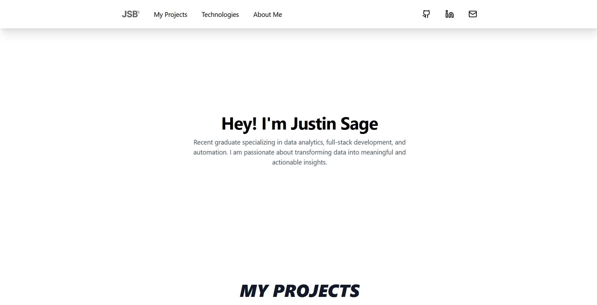

# JSB Personal

> :closed_lock_with_key: Live domain is up and running that is available upon request.

---

## **:information_desk_person: What It's About**

A personal website that showcases my projects, skills, and experience through the years. Built with the latest technologies, including Next.js, Tailwind CSS, and Supabase, which allows for a seamless experience across all devices, fast and optimized performance, and is designed to grow with me as I continue to learn and take on new challenges.

---

## **:hammer_and_wrench: How It Works**

| Category               | Technologies                                                                                                                                                                                          |
| ---------------------- | ----------------------------------------------------------------------------------------------------------------------------------------------------------------------------------------------------- |
| **Frontend**           | [Next.js](https://nextjs.org/), [React](https://react.dev/), [TypeScript](https://www.typescriptlang.org/), [Tailwind CSS](https://tailwindcss.com/), [Framer Motion](https://www.framer.com/motion/) |
| **Database & Backend** | [Supabase](https://supabase.com/) (PostgreSQL database with built-in APIs)                                                                                                                            |
| **Deployment**         | [Vercel](https://vercel.com/)                                                                                                                                                                         |
| **Tools**              | [ESLint](https://eslint.org/), [Prettier](https://prettier.io/), [PostCSS](https://postcss.org/), [Autoprefixer](https://github.com/postcss/autoprefixer)                                             |
| **Version Control**    | [Git](https://git-scm.com/), [GitHub](https://github.com/)                                                                                                                                            |

---

## **:clipboard: What's Included**

- **Dynamic Routing** - Projects come with its own dedicated page created dynamically with the Next.js App Router.
- **Fully Responsive** - Built with a mobile-first design approach perfect for any screen sizes.
- **Smooth Animations** - Smooth and clean transitions between sections by Framer Motion.
- **High Performance** - Fast load times and lightweight through Next.js and Vercel hosting.
- **Analytics** - Vercel Analytics and Speed Insights are incorporated to monitor performance and traffic.
- **Centralized** Data Management - Content is pulled directly from a cloud database allowing for seamless changes without redeployment.
- **Accessibility** - ARIA labels, semantic HTML, and responsive font sizes are used for an inclusive experience.

---

## :scroll: **License**

This project is unlicensed and intended for a personal website use only.

---
